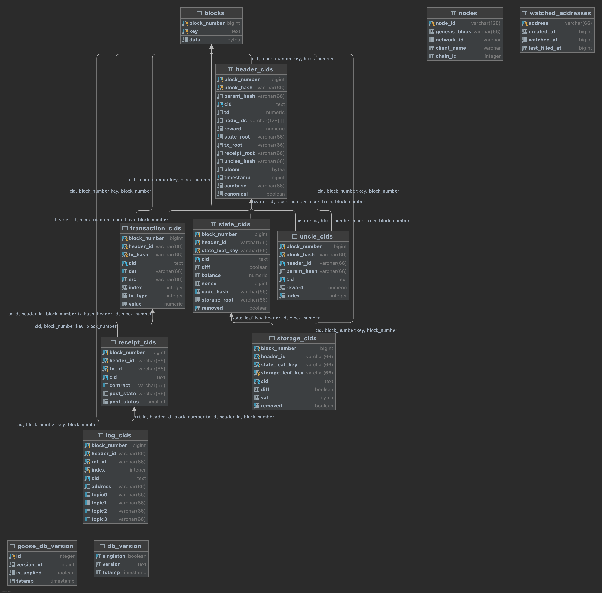

# ipld-eth-db
Schemas and utils for IPLD ETH Postgres database

## Database UML


## Run

* Remove any existing containers / volumes:

  ```bash
  docker-compose down -v --remove-orphans
  ```

* Spin up an access node and three data nodes using [docker-compose.test.yml](./docker-compose.test.yml):

  ```bash
  docker-compose -f docker-compose.test.yml up timescale-test-db pg_data_node_1 pg_data_node_2 pg_data_node_3
  ```

  Following final output should be seen on all the nodes:

    ```
    LOG:  TimescaleDB background worker launcher connected to shared catalogs
    ```

* Edit [startup_script.sh](./scripts/startup_script.sh) to change the number of migrations to be run:

  ```bash
  ./goose -dir migrations/vulcanizedb postgres "$VDB_PG_CONNECT" up-to 22
  ```

* In another `ipld-eth-db` terminal window, build an image `migrations-test` using [Dockerfile](./db/Dockerfile):

  ```bash
  docker build -t migrations-test -f ./db/Dockerfile .
  ```

* After the access and data nodes have spun up, start a container using `migrations-test` image to run the db migrations:

  ```bash
  # Here, we are running the container using host network.
  # So connect to access node on 127.0.0.1:8066
  docker run --rm --network host -e DATABASE_USER=postgres -e DATABASE_PASSWORD=password -e DATABASE_HOSTNAME=127.0.0.1 -e DATABASE_PORT=8066 -e DATABASE_NAME=vulcanize_testing_v4 migrations-test
  ```
